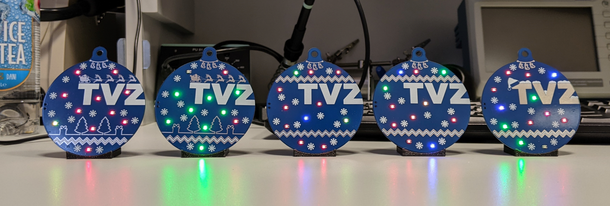

# TVZ-logo
Note: To fix the current KiCad 6.0 issues regarding 3D component models, add the missing KISYS3DMOD to point to the same location as KICAD6_3DMODEL_DIR

TVZ logo made to look like christmas tree ornament. Powered by either 2xAAA or 1xcoincell batteries.

Light them up: https://www.youtube.com/watch?v=5n3oKyAjeKg

